<div align="center">

# /letsgo

### The complete project kickoff orchestrator for Claude Code

<br/>


<br/>

> **15 steps. 80 skills. Every decision locked before a line of code is written.**

<br/>

</div>

---

`/letsgo` is a 15-step interactive build orchestrator for Claude Code. It classifies the project, locks every design and technology decision, configures the agent team, and hands off a fully-scoped brief to `autonomous-engineer`. Nothing gets guessed and nothing gets forgotten.

## Installation

```bash
npx skills add Clarkky1/letsgo-skill@letsgo -g -y
```

Invoke it with `/letsgo` in Claude Code, or say "letsgo build a…" in natural language.

---

## How the Flow Works

```mermaid
flowchart TD
 START([ /letsgo]) --> S1

 S1{Step 1\nPersonal or Client?}
 S1 -->|Personal| S2
 S1 -->|Client| CM[ Client Meeting Prep\n25 questions across goals,\naudiencepages, budget, legal]
 CM --> S2

 S2[Step 2\nScan codebase or gather brief]
 S2 --> S25[Step 2.5\nPlayback + confirm]
 S25 --> S3

 S3[Step 3\nBrand check + design system\nbrand-guidelines · design-system]
 S3 --> S4

 S4[Step 4\nUI Standard + Inspiration Brief\nhallmark · silencio · landonorris-ui\npixel-art · liquid-glass · portfolio-design]
 S4 --> S5

 S5[Step 5\nPlatform + Animation + Component Library\ngsap · framer-motion · lenis · matter.js\nshadcn · magic-ui · aceternity · skiper-ui]
 S5 --> S6

 S6[Step 6\n3-Terminal Setup + Session Resilience\nOrchestrator · Developer · QA\nwatchdog · mcp-reconnect]
 S6 --> S7

 S7[Step 7\nBackground Component\nspline · vanta · haikei · grainient · mesher]
 S7 --> S75

 S75[Step 7.5\nTypography + Color + Icons → Figma\nfontjoy · oklch · radix-colors · lucide]
 S75 --> S8

 S8[Step 8\nEngagement Design\nhooked-ux · psychology-principles · ui-ux-pro-max]
 S8 --> S9

 S9[Step 9\nTech Stack · DB · Auth · Cache · Pipeline\nsupabase · prisma · clerk · redis · github-actions]
 S9 --> S10

 S10[Step 10\nFolder Structure\nclean architecture · constants · shared types]
 S10 --> S11

 S11[Step 11\nSecurity Gate\nsecurity-scan · zod · api-rate-limiting]
 S11 --> S12

 S12[Step 12\nautonomous-engineer Handoff\narchitect → qa → developer → tdd]
 S12 --> S125

 S125[Step 12.5\nGraphify codebase map\ngfy · knowledge graph]
 S125 --> S13

 S13{Step 13\nDesign Quality Gate}
 S13 -->|Passes| S14
 S13 -->|Fails| FIX[refactoring-ui\nux-heuristics · taste\nimpeccable-style]
 FIX --> S13

 S14{Step 14\nMobile target?}
 S14 -->|Yes| AS[App Store Prep\nicons · screenshots · IAP]
 S14 -->|No| S15
 AS --> S15

 S15[Step 15\nn8n automation offer\ntest before push\nnext steps]
 S15 --> DONE([ Ship])

 style START fill:#6366f1,color:#fff,stroke:none
 style DONE fill:#10b981,color:#fff,stroke:none
 style CM fill:#f59e0b,color:#fff,stroke:none
 style FIX fill:#ef4444,color:#fff,stroke:none
 style S1 fill:#8b5cf6,color:#fff,stroke:none
 style S13 fill:#8b5cf6,color:#fff,stroke:none
 style S14 fill:#8b5cf6,color:#fff,stroke:none
```



---

---

## Design

> [!IMPORTANT]
> `/letsgo` is design-first. Every visual decision is locked before a single line of code is written: UI standard, component library, animation, typography, color, icons, background, and a Figma file with all tokens. The goal is that nothing looks like an AI-generated template.

### UI Standards

Pick one and commit. The skill recommends the right one based on project context.

| Standard | Character | Invoke |
|---|---|---|
| **Hallmark** | Expressive, layered, best default for open-ended work | `hallmark` |
| **portfolio-design** | Personal brands, portfolios, agency homepages | `portfolio-design` |
| **motion-design-school** | Course platforms, creative education | `motion-design-school` |
| **Silencio** | Bold anti-brand, agency studios, neo-brutalist | `website-ui-v2` |
| **Liquid Glass** | Glassmorphism, blur layers, Apple-adjacent premium | `liquid-glass-design` |
| **OFF+BRAND. Method** | Premium, alive, intentional : derive every decision from the subject, replace all browser defaults, finish all 5 layers (structure, visual, motion, interaction, polish) | `landonorris-ui` |
| **Pixel Art** | Retro games, sprites, 8-bit / 16-bit, limited palettes, dithering | `pixel-art` |

### Component Libraries

The skill asks which to use. Never assume. Multiple sources can be combined.

| Library | What it provides |
|---|---|
| **shadcn-ui** | Unstyled, copy-paste components. Full ownership over markup and styles |
| **Origin UI** | Production-ready extensions on top of shadcn |
| **Magic UI** | Animated, motion-forward components |
| **Motion Primitives** | Framer Motion component kit |
| **Skiper UI** | Premium animated hero sections and feature blocks |
| **Aceternity** | Bold, scroll-driven, dramatic UI blocks |
| **ReactBits** | Utility components and reusable patterns |
| **hover.dev** | Hover effects and micro-interaction components |
| **buildui.com** | Minimal, well-crafted React components |
| **Fancy Components** | Decorative, expressive, editorial |
| **UIverse** | CSS-only and Tailwind community components |
| **21st.dev** | Cross-library component search and discovery |
| **getdesign** | Design system component reference |
| **Framer marketplace** | Pre-built Framer components |

### Animation

| Library | Best for |
|---|---|
| **Framer Motion** | Declarative React animation, layout transitions, gestures |
| **GSAP** | Complex timelines, scroll-pinning, SplitText, heavy scroll sequences |
| **CSS Animations** | Lightweight hover and entrance effects, zero JS |
| **ui-animation** | Reusable animated React primitives |
| **gstac** | GSAP + ScrollTrigger + animations combined |
| **Lenis** | Smooth scroll, pairs with any of the above |
| **matter.js** | 2D physics, rigid-body simulations, falling elements |

### Typography, Color, and Icons

All three are locked before any UI code is written.

**Typography**: heading + body pair generated on Fontjoy, validated in context on Typewolf, tracking and measure rules enforced via `impeccable-style`.

**Color**: palette built on Realtime Colors, individual values picked via oklch.com, semantic token scales from Radix Colors with full light + dark mode support.

**Icons**: one set chosen, no mixing: Lucide (default), Phosphor (when weight matters), Tabler (maximum coverage), Iconoir (geometric), SVG Repo (brand logos and one-offs).

After tokens are locked, `figma-design-system` pushes everything (color styles, text styles, spacing scale, border radius scale) into a new Figma file via `figma-developer-mcp`.

### Background Components

Always asked. Never skipped.

Spline (3D scene) · Vanta.js (animated canvas) · Haikei (SVG blobs and dividers) · Grainient (grain + gradient) · Mesher (mesh gradient) · CSS Pattern (pure CSS repeating patterns) · SVG Backgrounds · Framer marketplace · endlesstools.io · CSS-only (animated gradient) · None

### Design Inspiration

> [!NOTE]
> At least 3 references must be locked into an **Inspiration Brief** before any UI code is written. The brief covers feeling, typography, color, icons, background, motion, and components.

Before building, at least 3 references are locked into an **Inspiration Brief** (feeling, references, typography, color, icons, background, motion, components). Sources span: Mobbin, Godly, Awwwards, Lapa Ninja, VibeUI, Aceternity, Emil Kowalski, Codrops, Grainient, 60fps.design, transition.style, Fontjoy, Typewolf, Realtime Colors, oklch.com, Radix Colors, Lummi, Impeccable, Taste, CodePen, and more.

### Design Quality Gate (Step 13)

> [!CAUTION]
> The build is not marked complete until this gate passes. Ship nothing that looks like every other app.

- `refactoring-ui`: hierarchy, spacing, and color violations fixed
- `ux-heuristics`: all 10 heuristics checked, severity 3+ issues flagged
- `taste`: does it look like only this product, or like every other app?
- `impeccable-style`: typography tracking, widows, spacing scale, hover/focus/active states

---

## How It Works: All 15 Steps

### Step 1: Personal or Client?

The first thing `/letsgo` asks is whether the project is **personal** or for a **client**.

- **Personal**: proceed straight to Step 2.
- **Client**: output a full **Client Meeting Prep** checklist (25 questions covering goals, audience, pages, branding, tech, timeline, budget, automation, and legal). Once the user confirms they have all the answers, carry those answers forward into the rest of the flow.

---

### Step 2: Check Project and Gather Context

Before asking anything, scan the current directory for existing files (`package.json`, `pubspec.yaml`, `Package.swift`, `requirements.txt`, etc.).

- **Existing codebase**: auto-detect the stack, framework, language, and dependencies. Output a friendly summary and suggest matching options for UI, animation, database, and auth based on what was detected.
- **New project**: ask what is being built, who it is for, and what the primary goal or feeling must be. Use `AskUserQuestion`. Do not proceed until the brief is clear.

If the user is still figuring out the concept, invoke `design-sprint` to run a focused discovery session first.

If Claude needs to connect to an external service during development (database, API, Slack, GitHub, file system), ask about MCP server setup and invoke the `mcp` skill. Once wired, [mcp-reconnect](https://github.com/palios-taey/mcp-reconnect) can auto-drive the `/mcp` → Reconnect menu after any server restart — worth installing for the dev loop.

---

### Step 2.5: Playback and Flow Confirmation

Once the brief is clear:

1. **Playback**: state the understood goals, audience, stack, and features.
2. **Flow summary**: outline the planned kickoff steps.
3. **Confirm or change**: ask the user to proceed or adjust specific details before moving forward.

---

### Step 3: Brand Check, Design System, and Assets

Ask whether existing brand guidelines (logo, colors, fonts, voice) and project assets (images, icons, illustrations, video) are available.

- **Has brand/assets**: collect the files or paths, lock them into design tokens and project directories.
- **No brand/assets**: invoke `brand-guidelines` to define primary color, type pair, voice, and logo direction. Pull any needed assets from `free-design-resources`.

After brand is locked, invoke `design-system` to establish spacing scale, color tokens, type scale, and component naming conventions for the entire build.

---

### Step 4: Identify and State the UI Standard

Analyze context and explicitly recommend one of seven UI standards. State the recommendation and why before asking the user to confirm.

| Standard | Best for | Skill |
|---|---|---|
| **Hallmark** | Open-ended projects, default choice | `hallmark` |
| **portfolio-design** | Personal brands, portfolios, agency homepages | `portfolio-design` |
| **motion-design-school** | Course platforms, creative education showcases | `motion-design-school` |
| **website-ui-v3 / Silencio** | Agencies, studios, bold anti-brand sites | `website-ui-v2` |
| **liquid-glass-design** | Glassmorphism, depth, blur layers, Apple-adjacent premium | `liquid-glass-design` |
| **landonorris-ui / The OFF+BRAND. Method** | Any project that needs to feel premium, alive, and intentional: derive colors, type, and motion from the subject, replace all browser defaults, finish all 5 layers | `landonorris-ui` |
| **pixel-art** | Retro games, sprite art, 8-bit/16-bit graphics, limited palettes, dithering | `pixel-art` |

After the standard is chosen:
- Invoke `design-principles` to reinforce contrast, hierarchy, alignment, proximity, and repetition.
- Invoke `getdesign` and `21st-dev` as component and pattern references.
- Invoke `design-inspiration` to pull at least 3 locked references before any UI code is written. Output the full **Inspiration Brief** covering feeling, references, typography, color, icons, background, motion, and components before moving to Step 5.

**Full design inspiration toolkit** covered by `design-inspiration`:

| Category | Sources |
|---|---|
| **Real product UI** | Mobbin, Pageflows, Screenlane |
| **Web design galleries** | Godly, Awwwards, Lapa Ninja, Dark Mode Design, Land-book |
| **Component libraries** | Aceternity, Origin UI, Magic UI, Motion Primitives, 21st.dev, Fancy Components, hover.dev, buildui.com, UIverse |
| **Motion / interaction** | 60fps.design, Codrops, transition.style, cubic-bezier.com, GSAP demos, CodePen |
| **Typography** | Fontjoy, Typewolf, Fonts in Use, Variable Fonts |
| **Color** | Realtime Colors, oklch.com, Radix Colors, Happy Hues |
| **Backgrounds / texture** | Grainient, Mesher, CSS Pattern, SVG Backgrounds |
| **Illustration / icons** | Lummi, SVG Repo, Lucide, Phosphor, Tabler, Iconoir |
| **Style references** | Emil Kowalski, VibeUI, Impeccable, Taste, oh-my-claude-sisyphus |

Also search **CodePen** for micro-interactions, canvas effects, CSS animations, and GSAP demos that can be ported into the project stack.

---

### Step 5: Platform Detection, Animation Stack, and Component Library

Detect the platform, then ask explicitly about the animation libraries and component sources to use. Never assume. Present options and let the user choose.

#### Web / Next.js / React

**Ask: Which animation approach?**

| Library | Best for | Skill |
|---|---|---|
| **Framer Motion** | Declarative React animation, layout transitions, gestures | `framer-motion` |
| **GSAP** | Complex timelines, scroll-pinning, SplitText, heavy scroll sequences | `gsap` + `motion-dev` |
| **CSS Animations** | Lightweight hover/entrance effects, no JS overhead | `css-animations` |
| **ui-animation** | Reusable animated React primitives | `ui-animation` |
| **gstac** | GSAP + ScrollTrigger + animations combined skill | `gstac` |
| **Lenis** | Smooth scroll wrapper (pairs with any of the above) | `lenis` |
| **matter.js** | 2D physics, rigid-body simulations, falling elements | (direct install) |

> [!TIP]
> GSAP in Next.js: `npm install gsap @gsap/react`. Always use the `useGSAP` hook, not `useEffect`. Mark the component `'use client'` in App Router. `useGSAP` handles cleanup automatically.

**Ask: Which UI component library / source?**

| Source | What it provides | When to use |
|---|---|---|
| **shadcn-ui** | Unstyled, copy-paste components. Full ownership | Default for Next.js projects |
| **Origin UI** | Production-ready shadcn extensions | When shadcn needs more variety |
| **Magic UI** | Animated, eye-catching components | When the UI needs motion-forward pieces |
| **Motion Primitives** | Framer Motion component kit | Framer-heavy projects |
| **Skiper UI** | Premium animated blocks | Hero sections, feature showcases |
| **21st.dev** | Component search across multiple libraries | Discovery and sourcing |
| **Aceternity** | Bold, scroll-driven, dramatic UI blocks | High-impact landing pages |
| **ReactBits** | Reusable patterns and utility components | General-purpose React |
| **hover.dev** | Hover effects and micro-interaction components | Interaction polish |
| **buildui.com** | Minimal, well-crafted React components | Clean product UIs |
| **Fancy Components** | Decorative, expressive components | Creative and editorial sites |
| **UIverse** | CSS-only and Tailwind community components | Pure CSS effects |
| **getdesign** | Design system component reference | Design system alignment |
| **Framer marketplace** | Pre-built Framer components | Framer-based projects |

Multiple sources can be combined. Lock the primary and supplementary sources before building.

#### iOS / macOS / SwiftUI
Animation: `apple-animations` (SF Symbols animations, spring physics, matched geometry)
Standards: `ios-hig`, `apple-design`, `swiftui-patterns`

#### Flutter
Animation: `flutter-animations` (implicit/explicit animations, custom painters, Rive)

#### Video generation
`remotion`: React-based programmatic video

#### AI application
`context-engineering` + `claude-api` or `azure-ai`

---

For any web project targeting multiple screen sizes, invoke `mobile-responsiveness`, `responsive-web-design`, `mobile-first-design`, and `frontend-design` to lock breakpoints, fluid grids, and tablet/mobile layout rules.

Invoke `animation-designer` to define the motion language: easing curves, durations, entrance/exit patterns, and stagger rules that stay consistent across the build.

---

### Step 6: Output the 3-Terminal Setup

Output the three terminal prompts, filled in with the project name, goal, stack, UI standard, and animation approach:

- **Terminal 1: Orchestrator**: plans architecture and delegates bite-sized tasks
- **Terminal 2: Developer**: builds clean, modular components matching design standards
- **Terminal 3: QA**: validates every component, runs tests, enforces compliance

> [!IMPORTANT]
> **No permission-asking — this applies to the Orchestrator too.** All three terminals have full authorization for everything inside the approved scope. The Orchestrator does not ask "can I delegate this?", "should I approve X?", or "is it okay to proceed?" — it delegates and acts. Workers do not ask mid-loop. Nobody asks for work that is already in the plan. Execute. Surface blockers only when genuinely stuck on something outside the approved scope.

For fully unattended runs, launch each terminal with `claude --dangerously-skip-permissions`, or pre-approve routine tools in `~/.claude/settings.json`:

```json
{ "allowedTools": ["Bash", "Read", "Write", "Edit", "Glob", "Grep"] }
```

#### Session Resilience (for unattended runs)

When workers run overnight, in loops, or across long autonomous tasks, two companion tools keep sessions alive:

**[claude-code-api-watchdog](https://github.com/palios-taey/claude-code-api-watchdog)** — detects when a transient API error (529, 429, 500, ECONNRESET) stalls a session at the prompt and auto-injects `Continue` with exponential backoff. Distinguishes transient errors from real usage limits (leaves those alone). Single file, no dependencies.

```bash
# Install
curl -O https://raw.githubusercontent.com/palios-taey/claude-code-api-watchdog/main/watchdog.py

# Dry-run first — logs every keystroke it WOULD send without sending any
python3 watchdog.py --sessions orchestrator,developer,qa --dry-run

# Live
python3 watchdog.py --sessions orchestrator,developer,qa
```

**[mcp-reconnect](https://github.com/palios-taey/mcp-reconnect)** — drives the `/mcp` → Reconnect menu sequence automatically after an MCP server restarts or drops. Eliminates the manual context-switch during the edit-restart-reconnect loop.

```bash
# Install
git clone https://github.com/palios-taey/mcp-reconnect && cd mcp-reconnect && sudo make install

# Reconnect all Claude Code sessions
mcp-reconnect

# Target the project sessions by name
mcp-reconnect orchestrator developer qa

# When calling FROM WITHIN a Claude Code session (e.g. a deploy script), always detach with delay
nohup mcp-reconnect --delay 10 &>/dev/null & disown
```

> [!TIP]
> Point `--sessions` at the exact tmux session names used in the 3-terminal setup above. Run watchdog with `--dry-run` first for at least one session before going live.

---

### Step 7: Background Component

> [!IMPORTANT]
> Always ask. Never skip. The background sets the atmosphere of the entire product.

Options presented via `AskUserQuestion`:

| Choice | What it does |
|---|---|
| **Spline** | 3D scene, lazy loading, mobile fallback. Invoke `spline` |
| **Vanta.js** | Animated canvas backgrounds. Apply `vanta-mobile-fix` for mobile targets |
| **Haikei** | SVG section dividers and blob exports. Invoke `haikei` |
| **Framer marketplace** | Pre-built free components. Invoke `framer-marketplace` |
| **Grainient** | Grain + gradient generator, export as WebP/SVG |
| **Mesher** | Mesh gradient with precise color placement, SVG or CSS export |
| **CSS Pattern** | Pure CSS repeating patterns, zero HTTP cost |
| **SVG Backgrounds** | Scalable SVG backgrounds, free |
| **endlesstools.io** | invoke `endlesstools` |
| **CSS-only** | Mesh gradient or animated gradient via `css-animations` |
| **None** | Skip the background component |

---

### Step 7.5: Lock Typography, Color, and Icons

Lock all three before any UI code is written.

**Typography:**
- Generate heading + body pairing on **Fontjoy** (`fontjoy.com`)
- Validate each font in context on **Typewolf** (`typewolf.com`)
- Apply `impeccable-style` tracking, line-height, and measure rules

**Color:**
- Build the palette on **Realtime Colors** (`realtimecolors.com`). Validate in a real UI, not swatches
- Pick individual values via **oklch.com** to match CSS token standards
- Use **Radix Colors** (`radix-ui.com/colors`) for semantic scales with light + dark mode

> [!WARNING]
> Choose one icon set and commit. Do not mix sets across a project.

**Icons:**
- **Lucide**: default for shadcn projects
- **Phosphor**: when weight is a design variable (thin luxury to bold energy)
- **Tabler**: when comprehensive coverage is needed (5000+ icons)
- **Iconoir**: geometric, distinctive style
- **SVG Repo**: brand logos, one-off illustrations, anything outside a standard set

After tokens are locked, invoke `figma-design-system` to create a Figma file (via `figma-developer-mcp`) with color styles, text styles, spacing tokens, border radius scale, and a Brand Foundation page. If the MCP is unavailable, output tokens as a structured list for manual Tokens Studio import instead.

---

### Step 8: Engagement Design

For projects with user flows, onboarding, or retention goals:

- `hooked-ux`: identify the internal trigger and variable reward
- `psychology-principles`: apply Fitts, Hick, social proof, and the peak-end rule to key screens
- `ui-ux-pro-max`: layer micro-interactions, empty states, error states, loading patterns, and progressive disclosure

---

### Step 9: Tech Stack and Database Selection

For existing codebases, inspect and suggest the database, ORM, and auth that best integrates with what was detected. For new projects, use `AskUserQuestion` for each choice. Never assume.

**Framework options (web):** Next.js (App Router), Remix, Astro, React + Vite, Vue/Nuxt, SvelteKit

**Framework options (mobile):** SwiftUI, UIKit, Flutter, React Native, Expo

**Backend (if needed):** Next.js API routes, Express, Fastify, NestJS, Django, FastAPI, Go
- Any API endpoint work triggers `api-design` and `rest-api-design` for resource modeling, REST standards, versioning, and OpenAPI docs.

**Database options:**

| Database | Best for |
|---|---|
| PostgreSQL (via Supabase or Railway) | Default choice: relational, full SQL, scales well |
| MySQL | Existing MySQL infra, simpler queries |
| SQLite | Local-first, no server needed |
| MongoDB | Flexible schema, rapid iteration |
| Supabase | Postgres + auth + realtime + storage in one |
| PlanetScale | MySQL-compatible, serverless, branching |
| Turso (libSQL) | Edge/SQLite, low latency, global apps |
| Redis | Cache, sessions, queues, pub/sub |
| Firestore | Firebase ecosystem, realtime sync, mobile |
| Neon | Serverless Postgres, great with Vercel |
| None | Static site or API-only consumer |

Once the database is chosen:
- JS/TS: invoke `prisma` (default) or `drizzle` (edge/serverless/lightweight)
- Supabase chosen: invoke `supabase` (covers DB + auth + storage)
- PostgreSQL or Supabase: invoke `supabase-postgres-best-practices` for indexing, RLS, schema design, and connection pooling

**Auth options:**
- **Clerk**: invoke `clerk`: Next.js-first, pre-built UI, orgs, MFA, passkeys
- **NextAuth**: invoke `nextauth`: open-source, OAuth + credentials, full control
- **Supabase Auth**: covered by `supabase` if Supabase is the database choice
- **None**: public-only app

**Caching:** If a database was chosen, ask about Redis. Yes triggers `redis-patterns`, and for high-concurrency targets, also `redis-connections` and `redis-clustering`.

**CI/CD Pipeline:** Ask about GitHub Actions. Yes triggers `github-actions-docs` and `deployment-pipeline-design` for multi-stage build, test, scan, and deploy pipelines.

**Observability:** Ask about structured logging. Yes triggers `logging-best-practices` for context-rich wide events per request.

**Validation:** `zod` is applied on all API routes and env vars regardless of other choices.

At the end of this step, output the complete locked stack block:

```
# DESIGN ==========================================
UI Standard: [chosen in Step 4]
Inspiration Brief: [3+ locked references from Step 4]
Component Library: [shadcn-ui / origin-ui / magic-ui / aceternity / skiper-ui / etc.]
Supplementary UI: [21st-dev, getdesign, reactbits, fancy-components, etc.]
Animation: [framer-motion / gsap / css-animations / ui-animation / gstac]
Smooth Scroll: [lenis / none]
Physics: [matter.js / none]
Background: [chosen in Step 7]
Typography: [heading font + body font, locked in Step 7.5]
Color Palette: [primary, surface, text, accent tokens, locked in Step 7.5]
Icons: [lucide / phosphor / tabler / iconoir / svg-repo]
Figma File: [link from figma-design-system / manual tokens list]

# DEVELOPMENT =====================================
Framework: [chosen framework]
Language: [TypeScript / Swift / Dart / Python / etc.]
Database: [chosen database]
ORM: [prisma / drizzle / SQLAlchemy / etc.]
Auth: [clerk / nextauth / supabase-auth / none]
Caching: [redis / none]
API Design: [api-design, rest-api-design / none]
DB Optimization: [supabase-postgres-best-practices / none]
Pipeline: [github-actions / none]
Observability: [logging-best-practices / none]
Validation: zod (all API routes + env vars)
Hosting: [Netlify / Vercel / Railway / Fly.io / App Store / etc.]
MCP: [list any MCP servers, or none]
```

---

### Step 10: Output Folder Structure

Read `references/project-structure.md` and output the full folder structure. Rules that always apply:

- Clean architecture: frontend, backend, api, shared. Always separate
- `constants/` in every top-level directory. No exceptions
- Env vars never accessed directly. Always go through `config/env.ts`
- Shared types in `shared/types/`

---

### Step 11: Enforce Security Standards

> [!WARNING]
> Run `/security-scan` before every handoff. Do not skip. No custom auth, no raw `process.env`, no raw SQL.

Run `/security-scan` (1,282 security tests across CLAUDE.md, MCP configs, hooks, and skills), then confirm before handoff:

- `.env` created, `.env.example` committed, `.env` in `.gitignore`
- `config/env.ts` with `zod` validation. Invoke `zod` skill: no raw `process.env` anywhere
- Auth library confirmed (Clerk, NextAuth, or Supabase Auth). Never custom auth
- `zod` validators in `api/validators/` for all input boundaries
- Security headers in `next.config.ts`
- ORM confirmed (Prisma or Drizzle). No raw SQL string concatenation
- `npm audit` runs as part of scaffold
- Rate limiting on all public API routes: invoke `api-rate-limiting` for token bucket, fixed window, or sliding window algorithms (via Redis if distributed)

---

### Step 12: Handoff to autonomous-engineer

Invoke `autonomous-engineer` with the full brief: goal, audience, platform, stack, UI standard, animation approach, background, brand tokens, engagement design decisions, folder structure, and security requirements.

```
architect_planner → qa_evaluator → developer_engineer → test_engineer → tdd_auto_fixer
```

---

### Step 12.5: Graphify (optional)

If `ANTHROPIC_API_KEY` is set, run `gfy` (`graphify . && open graphify-out/graph.html`) to map the codebase and auto-open the interactive knowledge graph. If no API key is set, this step is skipped silently.

---

### Step 13: Design Quality Gate

Before marking the build complete, run a final pass:

- `refactoring-ui`: fix hierarchy, spacing, and color violations
- `ux-heuristics`: check all 10 heuristics, flag severity 3+ issues
- `taste`: does it look like only this product, or like every other app?
- `impeccable-style`: typography tracking, widow fix, spacing scale, hover/focus/active states

The build is not done until this gate passes.

---

### Step 14: App Store Prep (mobile only)

If the project targets iOS, Android, or both, run the `appstore-guidelines` checklist:

- App icon at required sizes (1024×1024 iOS, 512×512 Android)
- Screenshots at required device sizes
- Privacy labels accurate
- Demo account + setup steps written for App Review Notes
- In-App Purchase via Apple IAP if selling digital content

---

### Step 15: End of Build

**n8n automation offer**: If any part of the build involved repeating triggers, API calls, or multi-service workflows, ask via `AskUserQuestion`:
- **Yes, automate it**: invoke `n8n`: gather follow-up details and output a ready-to-paste n8n AI prompt with setup instructions
- **Tell me what could be automated**: list 3–5 specific automation opportunities from what was just built, then ask again
- **Not right now**: skip

> [!CAUTION]
> Do NOT run `git commit` or `git push` until the user explicitly confirms it looks good locally.

**Test before push**: Open all changed files locally and tell the user to test.

**What's next**: Present 4–5 contextual next steps based on what was built.

---

## Skills Breakdown

<div align="center">

| Category | Count | Skills |
|---|:---:|---|
| UI Standards | 7 | hallmark, portfolio-design, motion-design-school, website-ui-v2, liquid-glass-design, landonorris-ui, pixel-art |
| Component Libraries | 11 | shadcn-ui, origin-ui, magic-ui, motion-primitives, skiper-ui, aceternity, reactbits, hover.dev, buildui.com, fancy-components, uiverse |
| Animation | 9 | framer-motion, gsap, motion-dev, css-animations, ui-animation, gstac, lenis, animation-designer, flutter-animations |
| Backgrounds | 6 | spline, vanta-mobile-fix, haikei, framer-marketplace, endlesstools, css-animations |
| Design System | 8 | brand-guidelines, design-system, figma-design-system, design-principles, design-inspiration, free-design-resources, impeccable-style, design-sprint |
| UX & Engagement | 3 | hooked-ux, psychology-principles, ui-ux-pro-max |
| Database & ORM | 4 | prisma, drizzle, supabase, supabase-postgres-best-practices |
| Auth | 3 | clerk, nextauth, supabase (auth) |
| Caching | 3 | redis-patterns, redis-connections, redis-clustering |
| DevOps | 3 | github-actions-docs, deployment-pipeline-design, logging-best-practices |
| Security & Validation | 3 | security-scan, zod, api-rate-limiting |
| API Design | 2 | api-design, rest-api-design |
| Mobile & Native | 5 | apple-animations, ios-hig, apple-design, swiftui-patterns, appstore-guidelines |
| AI & Agents | 4 | autonomous-engineer, claude-api, azure-ai, context-engineering |
| Responsive | 3 | mobile-responsiveness, responsive-web-design, mobile-first-design |
| Quality Gate | 4 | refactoring-ui, ux-heuristics, taste, impeccable-style |
| Utilities | 5 | mcp, n8n, remotion, graphify, frontend-design |
| Session Resilience | 2 | [claude-code-api-watchdog](https://github.com/palios-taey/claude-code-api-watchdog), [mcp-reconnect](https://github.com/palios-taey/mcp-reconnect) |
| **Total** | **80** | |

</div>

---

## Full Design Toolkit at a Glance

Everything `/letsgo` can ask about or invoke on the design side.

### UI Standards (Step 4)
`hallmark` · `portfolio-design` · `motion-design-school` · `website-ui-v2` (Silencio) · `liquid-glass-design` · `landonorris-ui` · `pixel-art`

### Component Libraries (Step 5)
`shadcn-ui` · `origin-ui` · `magic-ui` · `motion-primitives` · `skiper-ui` · `21st-dev` · `aceternity` · `reactbits` · `hover.dev` · `buildui.com` · `fancy-components` · `uiverse` · `getdesign` · `framer-marketplace`

### Animation Libraries (Step 5)
`framer-motion` · `gsap` · `motion-dev` · `css-animations` · `ui-animation` · `gstac` · `lenis` · `matter.js` · `animation-designer`

### Background Components (Step 7)
`spline` · `vanta` + `vanta-mobile-fix` · `haikei` · `framer-marketplace` · `endlesstools` · Grainient · Mesher · CSS Pattern · SVG Backgrounds · CSS-only

### Typography Tools (Step 7.5)
Fontjoy · Typewolf · Variable Fonts · `impeccable-style`

### Color Tools (Step 7.5)
Realtime Colors · oklch.com · Radix Colors · Happy Hues

### Icon Sets (Step 7.5)
Lucide · Phosphor · Tabler · Iconoir · SVG Repo

### Design Inspiration Sources (Step 4)
Mobbin · Godly · Awwwards · Lapa Ninja · Dark Mode Design · Pageflows · Screenlane · Land-book · VibeUI · Aceternity · Origin UI · Magic UI · Motion Primitives · 21st.dev · Fancy Components · hover.dev · buildui.com · UIverse · Emil Kowalski · Grainient · Mesher · CSS Pattern · SVG Backgrounds · Lummi · Fontjoy · Typewolf · Fonts in Use · Variable Fonts · Realtime Colors · oklch.com · Radix Colors · Happy Hues · Lucide · Phosphor · Tabler · Iconoir · SVG Repo · 60fps.design · Codrops · transition.style · cubic-bezier.com · Impeccable · Taste · oh-my-claude-sisyphus · CodePen

### Design System and Quality (Steps 3, 8, 13)
`brand-guidelines` · `design-system` · `figma-design-system` · `design-principles` · `design-inspiration` · `free-design-resources` · `hooked-ux` · `psychology-principles` · `ui-ux-pro-max` · `refactoring-ui` · `ux-heuristics` · `taste` · `impeccable-style`

---

## Reference Files

| File | Contents |
|---|---|
| `references/ui-standards.md` | Design standards, component stack, background tools, 3-terminal template |
| `references/project-structure.md` | Clean architecture folder layout, constants rules, env var handling |
| `references/security.md` | Full OWASP checklist, auth rules, input validation, env var handling, security headers |

---

## Guardrails

> [!IMPORTANT]
> These rules are non-negotiable. Every step runs. Every choice is asked. Nothing is assumed.

- Never skip a step
- Always use `AskUserQuestion`. Never guess or assume
- Invoke the matching skill for every tool chosen
- Run `security-scan` before every handoff
- Do not push until the user confirms locally
